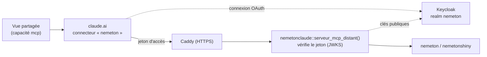

# nemetonClaude

<!-- badges: start -->
[](https://github.com/pobsteta/nemetonclaude/actions/workflows/ci.yml)
[](https://github.com/pobsteta/nemetonclaude/releases/latest)
[](https://codecov.io/gh/pobsteta/nemetonclaude)
[](https://eupl.eu/1.2/fr/)
<!-- badges: end -->

Visualisation de [nemeton](https://github.com/pobsteta/nemeton) dans Claude,
sous forme de plugin : un **connecteur MCP** qui calcule, et des
**artéfacts Claude** (pages web publiées, partageables par lien) qui affichent.
L'application [nemetonshiny](https://github.com/pobsteta/nemetonshiny) reste la
référence fonctionnelle.

Le brief qui cadre le projet est dans
[`specs/BRIEF-visualisation-nemeton-claude.md`](specs/BRIEF-visualisation-nemeton-claude.md).

## Contenu (lots 1 et 2)

| Dossier | Rôle |
| --- | --- |
| `r/` | Paquet R **nemetonclaude** : étend le serveur MCP de nemetonshiny (8 outils existants) avec `chercher_commune`, `parcelles_commune`, `creer_projet`, `vue_atlas`, `contexte_carto`, `detail_indicateur` ; le sert en local (stdio) ou à distance (HTTP, authentification Keycloak, liens de téléchargement signés) |
| `vues/moteur/` | Moteur commun des vues : `nemeton-view.js` (carte Leaflet sans tuiles, palettes, radar, i18n FR/EN, appels au connecteur) et `nemeton-view.css` (charte, thème clair et sombre, styles Leaflet inlinés) |
| `vues/selection/` | **Vue 0 — Sélection des parcelles** : carte de la commune, clic pour ajouter ou retirer, recherche « AB 12 », sélection au rectangle, surface totale, BD Forêt en repère, « Créer le projet » via le connecteur ou liste d'IDU à copier |
| `vues/atlas/` | **Vue 1 — Atlas du projet** : rail des 12 familles, carte choroplèthe ou bivariée 5 × 5, tableau lié à la carte, fiche d'UG avec radar 12 axes et sous-indicateurs, valeurs manquantes hachurées avec leur raison, comparaison de deux UG, « Demander à Claude », exports CSV et GeoPackage |
| `vues/calcul/` | **Vue 2 — Calcul en cours** : suivi en direct d'`etat_calcul` (avancement, indicateurs, temps écoulé, tâche), Annuler avec confirmation, Relancer, journal en cas d'échec, invitation à ouvrir l'Atlas ; lisible sur téléphone |
| `vues/exemples/` | Données **fictives** pour essayer les vues sans nemeton, et catalogue des familles du cœur |
| `skills/nemeton-vues/` | Skill du plugin : quand ouvrir quelle vue, comment la publier, contrat de données, charte |
| `.claude-plugin/`, `.mcp.json` | Manifeste du plugin et déclaration du serveur MCP `nemeton` |
| `deploiement/` | Connecteur distant : client Keycloak, proxy HTTPS (Caddy), service systemd, variables d'environnement |
| `outils/`, `tests/` | Fabrication (CSS, données d'exemple, assemblage d'une vue, versions) et tests unitaires et de bout en bout |

## Installation

### Connecteur R

Le serveur MCP tourne en local (stdio), sur la machine qui a vos projets
nemeton.

```r
# install.packages("remotes")
remotes::install_github("pobsteta/nemetonshiny")
remotes::install_github("pobsteta/nemetonclaude", subdir = "r")
install.packages(c("mcptools", "happign"))  # happign : repli cadastre, BD Forêt, BD TOPO
```

Le serveur se lance par `Rscript -e "nemetonclaude::serveur_mcp()"` (déjà
déclaré dans `.mcp.json`). Variables utiles : `NEMETON_PROJECT_DIR` (dossier
des projets, comme nemetonshiny) et `NEMETON_CLAUDE_VUES_DIR` (dossier des
fichiers GeoJSON écrits pour les vues, par défaut le cache utilisateur R). Le
serveur doit tourner dans une locale UTF-8.

### Plugin Claude Code

```bash
claude --plugin-dir <chemin de ce dépôt>   # charge le plugin pour la session
```

Le plugin apporte le serveur MCP `nemeton` et le skill `nemeton-vues`.

## Connecteur distant (lot 2)

Le connecteur local ne répond qu'au propriétaire d'une vue, dans l'app Claude
de bureau. Pour qu'une vue **partagée** reste vivante (créer un projet, suivre
un calcul, lire un indicateur) pour chacun de ses lecteurs, sur le web ou le
téléphone, le même serveur se sert en HTTP comme **connecteur claude.ai**.
Chaque lecteur s'y connecte avec son compte Keycloak ; ses droits suivent ses
rôles.



Le serveur est une *ressource protégée* au sens de la spécification MCP :

- `GET /.well-known/oauth-protected-resource` désigne Keycloak comme serveur
  d'autorisation ;
- `POST /mcp` exige un jeton d'accès Keycloak valide (signature, émetteur,
  audience `nemeton-claude`, expiration), sinon `401` avec le défi
  `WWW-Authenticate` qui lance la connexion OAuth côté claude.ai ;
- les rôles du realm décident des outils : `lecteur` lit (projets, vues,
  états de calcul), `gestionnaire` et `admin` écrivent aussi (créer un
  projet, lancer ou annuler un calcul, rapport, GeoPackage) ; un compte sans
  rôle nemeton reçoit `403` ;
- les fichiers écrits par les outils (GeoJSON des vues, rapport, GeoPackage)
  sont servis par des liens signés valables une heure, ajoutés aux réponses
  sous `urls`.

### Mise en place

1. **Keycloak** : dans le realm nemeton (celui de nemetonshiny), *Clients →
   Import client* avec
   [`deploiement/keycloak/client-nemeton-claude.json`](deploiement/keycloak/client-nemeton-claude.json)
   (client confidentiel, PKCE, retour `https://claude.ai/api/mcp/auth_callback`,
   mappeur d'audience `nemeton-claude`). Régénérer son secret (onglet
   *Credentials*) et donner aux comptes le rôle `lecteur`, `gestionnaire` ou
   `admin`.
2. **Serveur** : installer le paquet R (voir plus haut), puis copier
   [`deploiement/nemeton-claude.env.exemple`](deploiement/nemeton-claude.env.exemple)
   en `/etc/nemeton-claude.env` et le remplir, installer
   [`deploiement/nemeton-claude.service`](deploiement/nemeton-claude.service)
   (systemd) et [`deploiement/Caddyfile`](deploiement/Caddyfile) (HTTPS
   automatique). Le serveur R n'écoute qu'en local.
3. **Vérifier** :
   ```bash
   curl https://nemeton.example.org/sante
   curl https://nemeton.example.org/.well-known/oauth-protected-resource
   curl -i -X POST https://nemeton.example.org/mcp   # 401 + WWW-Authenticate
   ```
4. **claude.ai** : *Réglages → Connecteurs → Ajouter un connecteur
   personnalisé*, nom `nemeton`, URL `https://nemeton.example.org/mcp` ; dans
   les réglages avancés, l'identifiant `nemeton-claude` et le secret du
   client. Chaque utilisateur se connecte ensuite avec son compte Keycloak.

`NEMETON_CLAUDE_ISOLATION=utilisateur` donne à chaque compte son propre
dossier de projets ; par défaut (`collectif`), tous les comptes de l'instance
partagent les projets, comme dans nemetonshiny.

## Tout essayer d'un coup

```bash
outils/essayer.sh          # connecteur R (installe nemetonshiny >= 1.0.0 si besoin),
                           # tests des vues, puis aperçu sur http://localhost:8765
outils/essayer.sh claude   # Claude Code avec le plugin chargé
```

Étapes séparées : `outils/essayer.sh r`, `vues`, `apercu` (`--help` pour le
détail).

## Essayer les vues sans nemeton

```bash
npm install
npm run exemples              # régénère vues/exemples/ (données fictives)
node outils/assembler-vue.mjs atlas vues/exemples/atlas .apercu/atlas   # idem calcul, selection
npx serve .apercu             # puis ouvrir /atlas/ et /selection/
npm test                      # tests unitaires puis de bout en bout (Chromium)
```

Côté R :

```bash
cd r && Rscript -e 'devtools::test()'
```

## Vérification et versions

À chaque PR et sur `main`, le workflow **CI** vérifie :

- que la version est la même dans `r/DESCRIPTION`, `package.json`,
  `.claude-plugin/plugin.json` et `NEWS.md` (`npm run versions`) ;
- les vues : tests unitaires du moteur et des outils avec couverture
  (`npm run test:unitaires`, `npm run couverture`), tests de bout en bout dans
  Chromium (`npm run test:vues`) ;
- le connecteur R : `R CMD check` sans avertissement, tests testthat,
  couverture (covr).

Quand la CI passe sur `main`, le workflow **release** publie une version :

| Étiquette de la PR | Version |
| --- | --- |
| aucune | correctif, `0.1.0` → `0.1.1` |
| `version:mineure` | `0.1.0` → `0.2.0` |
| `version:majeure` | `0.1.0` → `1.0.0` |
| `version:aucune` | pas de version |

Il écrit la version dans les quatre fichiers, ajoute à `NEWS.md` le titre des
PR fusionnées depuis la version précédente, pousse le commit « Version X.Y.Z »,
pose l'étiquette `vX.Y.Z` et crée la release GitHub. Une version montée à la
main dans la PR (`node outils/version.mjs monter mineure`) est publiée telle
quelle. Les PR sont fusionnées en « squash » : leur titre devient la ligne de
`NEWS.md`.

## Limites connues

- La capacité `mcp` d'un artéfact vers `host:nemeton` ne répond que dans
  l'application Claude de bureau où le serveur est installé, et pour le
  propriétaire de l'artéfact. Les vues préfèrent le connecteur distant quand
  le lecteur l'a ajouté ; sans l'un ni l'autre, elles restent lisibles et
  passent par la conversation (liste d'IDU à copier, état de calcul figé, pas
  de valeur brute à la demande).
- Le connecteur distant est un seul processus R : il traite les requêtes une
  à une. Un appel long (cadastre d'une grande commune) fait attendre les
  autres ; les calculs, eux, tournent dans des processus détachés.
- Avec le connecteur distant, Claude télécharge les fichiers des vues par les
  liens `urls` avant de les publier : cela suppose un environnement avec
  fichiers (Claude Code). Dans une conversation claude.ai sans fichiers, les
  données d'une vue doivent passer par l'option `inclure_geojson` (moins de
  2 Mo).
- Le cœur nemeton déclare aujourd'hui 41 sous-indicateurs, et non 31 comme
  dans le brief. Les vues lisent le catalogue joint aux données et s'adaptent
  au nombre réel.
- Lots suivants : plan d'actions partagé (lot 3), rasters pré-rendus (lot 4).
