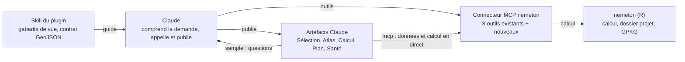

# Brief — Visualisation nemeton dans Claude

6 octobre 2026 · Pascal Obstetar

## Contexte et objectif

L'objectif est de porter la visualisation de nemeton dans Claude sous forme de plugin : un connecteur MCP qui calcule, et des artéfacts Claude (pages web publiées) qui affichent. L'application `nemetonshiny` reste la référence fonctionnelle à transposer, pas à copier écran par écran.

- **nemeton** (R) calcule 31 sous-indicateurs regroupés en 12 familles (B, C, W, A, F, L, T, R, S, P, E, N) sur des parcelles forestières `sf`, normalisés 0–100, avec indices de famille, niveaux de précision NDP et confiance φ.
- **nemetonshiny** (R/Shiny) est l'interface actuelle de visualisation et de saisie.
- **Cible** : l'utilisateur demande en langage naturel (« calcule et montre-moi la forêt de X »), Claude appelle nemeton via le connecteur et publie une vue interactive partageable par lien.

Un prototype Leaflet a validé le principe le 6 octobre 2026 : carte choroplèthe des 12 familles et radar par parcelle, sur données fictives.

## Persona : créer son premier projet

La première demande d'un utilisateur est toujours la création d'un projet. Il connaît sa forêt sur le terrain et sur le plan cadastral, mais pas les identifiants que nemeton attend : le parcours doit les trouver pour lui et finir sur un clic de carte.

| | |
| --- | --- |
| **Qui** | Propriétaire, gestionnaire ou élu qui ouvre nemeton pour la première fois |
| **Ce qu'il sait** | Son département, sa commune, l'emplacement de ses parcelles sur un plan |
| **Ce qu'il ignore** | Le code INSEE, les références cadastrales exactes (section, numéro, IDU) |
| **Ce qu'il attend** | Désigner sa forêt en quelques clics, voir la surface totale, lancer le diagnostic |
| **Ce qui le fait abandonner** | Un formulaire de références à remplir, une carte qui ne charge pas, une sélection perdue |

**Parcours**

1. **L'utilisateur** annonce son département, puis sa commune (« Côte-d'Or, Velars-sur-Ouche »).
2. **Claude** cherche le code INSEE de la commune. En cas d'homonymes ou de commune nouvelle, il propose les candidats au lieu de choisir.
3. **Le connecteur** récupère les parcelles de la commune par son code INSEE sur cadastre.data.gouv.fr (cadastre Etalab, GeoJSON WGS84), avec repli sur happign si le service ne répond pas.
4. **Claude** publie la **vue Sélection** : une carte Leaflet des parcelles de la commune.
5. **L'utilisateur** clique sur les parcelles qui constituent sa forêt, puis valide.
6. **La vue** transmet la liste des parcelles au connecteur, qui crée le projet ; Claude enchaîne sur le calcul et la vue Calcul.

**Vue 0 — Sélection des parcelles**

- Parcelles en polygones cliquables, contour de commune et limites de sections en repère, puisque les tuiles externes sont bloquées.
- Infobulle au survol : section, numéro, contenance. Un clic ajoute ou retire la parcelle.
- Panneau latéral : parcelles retenues, nombre et surface totale en hectares, mise à jour à chaque clic.
- Recherche par référence (« AB 12 ») et sélection au rectangle, pour les forêts de plusieurs dizaines de parcelles.
- Aide au repérage : parcelles recouvertes par la BD Forêt légèrement teintées, sans être présélectionnées.
- Bouton « Créer le projet » : appel direct au connecteur par la capacité `mcp`. À défaut, la vue affiche la liste des IDU à copier dans la conversation.

**Outils du connecteur pour ce parcours**

| Outil | Rend | Existant |
| --- | --- | --- |
| `chercher_commune(departement, nom)` | Candidats : nom, code INSEE, code postal | Non (`service_communes.R` l'a déjà côté R) |
| `parcelles_commune(insee)` | GeoJSON des parcelles : IDU, section, numéro, contenance | Partiel : `parcelles_commune()` dans `api.R`, à exposer en MCP |
| `creer_projet(nom, insee, parcelles)` | Identifiant du projet créé | Oui côté R : `projet_creer()` |

**Points d'attention**

- Une commune peut dépasser 10 000 parcelles. Au-delà d'environ 5 Mo de GeoJSON simplifié, la vue charge les sections une à une.
- La sélection en cours doit survivre à un rechargement : stockage local du navigateur, sans valeur de référence.
- Source cadastrale retenue : le cadastre Etalab en GeoJSON par commune, déjà lu par l'application (`fetch_api_cadastre()` dans `service_cadastre.R`, URL `https://cadastre.data.gouv.fr/bundler/cadastre-etalab/communes/{INSEE}/geojson/parcelles`). Une requête par commune, déjà en WGS84, même donnée DGFiP que l'EDIGéO. L'archive EDIGéO départementale n'est pas utilisée.

## Vues existantes de nemetonshiny

L'application compte 7 onglets de premier niveau, un menu de 12 familles et environ 78 000 lignes de R. Environ un tiers des vues est de la visualisation pure, transposable en artéfact ; le reste est de la saisie, du workflow long ou de la configuration, qui relève du connecteur ou de la conversation.

| Vue (module) | Ce qu'elle montre | Composants | Portage proposé |
| --- | --- | --- | --- |
| Sélection (`mod_home`, `mod_map`, `mod_search`) | Recherche de commune, choix de parcelles cadastrales, lancement du calcul | Leaflet OSM/Satellite, formulaires, progression | Conversation + connecteur + **vue Sélection** (lot 1) |
| Unités de gestion (`mod_ug`) | Fusion, découpe et groupes d'UG | Leaflet + barre de dessin, DT, 9 modales | Hors lot 1 (édition géométrique) |
| Synthèse (`mod_synthesis`) | Score global, radar 12 familles, commentaire IA | Radar ggplot (PNG), tableau, exports PDF/GPKG | **Artéfact prioritaire** |
| Familles ×12 (`mod_family`) | Une carte par indicateur, statistiques, commentaire IA | Leaflet viridis / YlOrRd, DT | **Artéfact prioritaire**, fusionné avec la synthèse |
| Plan d'actions (`mod_action_plan`) | Actions sylvicoles, priorités, bilan cumulé | Leaflet, DT, plotly, kanban, chat IA | Artéfact lot 3 (état partagé) |
| Terrain (`mod_sampling`, `mod_field_ingest`) | Plans d'échantillonnage, import QField | Leaflet, exports `.qgz` | Connecteur (fichiers), aperçu cartographique en artéfact |
| Accessibilité, Desserte | Classes de débardage, réseau, profils | Leaflet raster, swipe, plotly | Artéfact lot 4 (rasters pré-rendus) |
| Monitoring FAST / FORDEAD / RECONFORT | Alertes de dépérissement, séries par pixel | Rasters Leaflet, plotly, 7 sous-onglets | Artéfact lot 4, calcul long côté connecteur |
| reGeneration (`mod_regeneration`) | Vulnérabilité climatique, contexte E-OBS | Leaflet RdYlGn, raster bivarié 5×5, 4 plotly | Artéfact lot 4 |
| Réglages (`mod_theia_config`, `mod_sources_config`, `mod_rag_admin`) | Clés API, seuils, corpus RAG | Modales, formulaires | Configuration du connecteur, pas d'artéfact |

**Points de friction relevés** : écrans très denses (Monitoring, 4 843 lignes, 3 modes et 7 sous-onglets), sélecteur de profil expert et bouton IA répétés dans 13 vues, bloc d'exports recopié dans 3 vues, attentes longues (jusqu'à plus d'une heure) suivies par des notifications.

**Déjà en place** : un serveur MCP stdio (`R/service_mcp.R`, lancé par `inst/mcp/server.R`, outils déclarés avec `ellmer::tool()` et servis par `mcptools::mcp_server()`) avec 8 outils (`lister_projets`, `resume_projet`, `lancer_calcul`, `etat_calcul`, `annuler_calcul`, `generer_rapport`, `exporter_gpkg`, `url_app`), une API R contractuelle (`R/api.R`, `CONTRAT.md`) et des liens profonds `?project=…&tab=…`. Les réponses MCP sont du JSON `{"ok":true,…}` ou `{"ok":false,"erreur","classe","candidats"}`.

## Contraintes et leviers des artéfacts Claude

Un artéfact est une page HTML publiée sur claude.ai, privée jusqu'au partage, qui tourne dans un cadre verrouillé. Deux contraintes pèsent sur la cartographie ; en contrepartie, les capacités d'exécution rendent la page aussi vivante qu'une app Shiny, sans serveur web à maintenir.

**Contraintes**

- **Pas de tuiles externes.** Les fonds OSM, Esri, IGN/Géoplateforme et toute requête vers un autre domaine sont bloqués. Le fond de carte doit être vectoriel (GeoJSON embarqué) ou une image pré-rendue jointe à l'artéfact.
- **Pas de raster à la volée.** Les rasters Monitoring, accessibilité ou E-OBS doivent être pré-rendus en PNG géoréférencés (emprise connue) côté R, puis joints comme fichiers ou assets. Limite : 16 Mo par page, 15 Mo par fichier binaire, 20 Mo par asset.
- **Bibliothèques** chargées uniquement depuis cdnjs, jsDelivr ou unpkg (Leaflet, MapLibre, ECharts, Observable Plot). Feuilles de style des bibliothèques à inliner. Pas de `window.print()`, pas d'iframe, pas de `<a download>`.
- **Navigateur seul** : pas de R, de Python ni de GDAL dans la page. Tout calcul reste dans nemeton, derrière le connecteur.

**Leviers (capacités d'exécution)**

| Capacité | Ce qu'elle permet | Usage nemeton |
| --- | --- | --- |
| `mcp` | La page appelle les connecteurs du lecteur avec ses propres droits (`watchTool`, `callTool`) | Lire un projet, créer un projet, lancer un calcul, suivre `etat_calcul` sans repasser par la conversation |
| `sample` | La page pose une question à Claude, le lecteur paie l'usage | Remplace les boutons « Générer IA » et les profils experts |
| `db` | Données partagées, règles d'accès, abonnement en direct | Plan d'actions, commentaires, statut de validation terrain |
| `downloads` | Proposer un fichier au lecteur, avec confirmation | Exports GeoPackage, CSV, rapport |
| `assets` | Stocker images, PDF, données de l'artéfact | Rasters pré-rendus, photos terrain |
| `comments`, `user`, `room` | Commentaires ancrés, identité du lecteur, présence en direct | Revue collective d'un diagnostic avec un propriétaire ou un élu |

**Condition à lever** : la capacité `mcp` n'appelle qu'un connecteur claude.ai (serveur MCP distant) ou un serveur local déclaré `host:nemeton`, et ce dernier ne répond que dans l'app Claude de bureau où il est installé. Le serveur actuel est en stdio local : il convient pour un usage personnel, pas pour partager une vue.

## Propositions UX

La proposition centrale est de remplacer les 19 onglets par **quatre vues ciblées** (plus la vue Sélection à la création), ouvertes depuis la conversation. La conversation sert de point d'entrée et de commande ; chaque vue sert à explorer, décider ou partager.

**Parcours type**

1. L'utilisateur écrit : « Diagnostique la forêt communale de Velars-sur-Ouche, profil élu local ».
2. Claude identifie la commune, ouvre la vue Sélection, crée le projet à partir des parcelles cliquées, lance le calcul et ouvre la **vue Calcul**.
3. À la fin du calcul, la vue Calcul propose d'ouvrir l'**Atlas**.
4. L'utilisateur explore, pose ses questions à Claude dans l'Atlas, puis partage le lien ou demande le rapport.

**Vue 1 — Atlas du projet** (remplace Synthèse + 12 Familles)

- Carte plein écran ; à gauche, un rail des 12 familles affichant chacune son score projet sur une mini-barre, cliquable pour colorer la carte.
- Clic sur une UG : un tiroir avec radar 12 axes, score global, puis descente famille → 31 sous-indicateurs, chacun avec sa valeur brute, sa note 0–100 et sa source.
- **Incertitude visible** : NDP et confiance φ rendus par une opacité ou des hachures, et les valeurs manquantes (A5 en milieu rural, par exemple) en gris explicite avec leur raison en infobulle, jamais en zéro.
- **Carte bivariée de compromis** : croiser deux familles (Production × Biodiversité, Social × Risques) pour montrer où les objectifs s'opposent. La légende 5×5 existe déjà dans nemeton.
- **Mode comparaison** : deux UG côte à côte, ou un même projet à deux dates (rideau de comparaison, comme `nemeton_swipe.js`).
- Carte, tableau et radar sont liés : survoler une ligne surligne la parcelle, filtrer le tableau filtre la carte.

**Vue 2 — Calcul en cours**

Une carte de progression qui suit `etat_calcul` en direct (indicateur courant, n sur 31, temps écoulé, journal en cas d'échec), avec un bouton Annuler. Elle remplace les dizaines de notifications et reste consultable depuis le téléphone pour les calculs de plus d'une heure.

**Vue 3 — Plan d'actions partagé**

Carte + kanban sur des données partagées (`db`), modifiables à plusieurs. Commentaires ancrés sur une action, et Claude qui propose des actions à valider plutôt qu'à appliquer d'office.

**Vue 4 — Santé des forêts**

Une frise temporelle unique pour FAST, FORDEAD et RECONFORT au lieu de trois modes, rasters pré-rendus par date, et série par UG au clic. Le choix d'indice et l'opacité vivent une seule fois, dans la barre de la carte.

**Principes transverses**

- **Un seul point d'IA** : un champ « Demander à Claude » contextuel (UG ou famille sélectionnée), le profil expert choisi une fois par projet, la réponse citant ses sources. Il remplace les 13 couples sélecteur + bouton.
- **Rapport en document Claude** plutôt qu'en PDF figé : commentable, modifiable, exportable en PDF ou Word.
- **Exports au même endroit** dans chaque vue (GeoPackage, CSV, rapport), proposés par téléchargement confirmé.
- **Sobriété visuelle** : thème clair et sombre, palettes perceptuelles (viridis, divergente pour les risques), vert `#1B6B1B` réservé à l'action principale et ambre `#E8A33D` aux contenus générés par IA, comme dans `CLAUDE.md`.
- **Mobile terrain** : l'Atlas lisible à 400 px, tiroir en panneau bas.
- **FR/EN** et accessibilité WCAG AA, comme l'application actuelle.

## Architecture cible

Le connecteur est le seul à parler à nemeton ; Claude et les artéfacts passent par lui. On étend le serveur MCP existant au lieu d'en écrire un nouveau.

Claude publie la vue avec ses données ; la vue relit ensuite le connecteur en direct (`mcp`) et interroge Claude pour les commentaires (`sample`).

**Outils à ajouter au connecteur**

| Outil | Rend | Lot |
| --- | --- | --- |
| `chercher_commune(departement, nom)` | Candidats : nom, code INSEE, code postal | 1 |
| `parcelles_commune(insee)` | GeoJSON WGS84 des parcelles (IDU, section, numéro, contenance) | 1 |
| `creer_projet(nom, insee, parcelles)` | Identifiant du projet créé | 1 |
| `vue_atlas(projet)` | GeoJSON WGS84 simplifié, une entité par UGF, + bloc projet | 1 |
| `contexte_carto(projet)` | Routes et hydrographie BD TOPO découpées au projet | 1 |
| `detail_indicateur(projet, ug, code)` | Valeur brute, note, source, statut d'un sous-indicateur | 1 |
| `vue_rasters(projet, couche, date)` | PNG + emprise WGS84 | 4 |

**Contrat de données de l'Atlas** (propriétés de chaque entité) :

- identité : `ug_id`, `label`, `groupe`, `surface_ha` ;
- 12 indices `famille_*` (0–100 : `famille_carbone`, `famille_biodiversite`, `famille_eau`, `famille_air`, `famille_sol`, `famille_paysage`, `famille_temporel`, `famille_risque`, `famille_social`, `famille_production`, `famille_energie`, `famille_naturalite`) et 31 `indicateur_<code>_<slug>_norm` ;
- statut `.<code>_status` pour expliquer chaque valeur manquante ;
- en tête du fichier : `project_id`, `name`, `global_score`, `ndp_level`, `confidence`, `updated_at`, `langue`.

La géométrie passe par `st_transform(4326)` puis `st_simplify` pour rester sous 5 Mo.

**Moteur de vue** : `nemeton-view.js` et `.css` publiés une fois dans un artéfact modèle, puis réutilisés par chaque vue de projet, qui n'apporte que sa page et son GeoJSON. Une correction du moteur profite à toutes les nouvelles vues.

**Skill du plugin** : quand ouvrir quelle vue, le contrat ci-dessus, les gabarits, la charte (couleurs de `CLAUDE.md`, FR/EN) et les profils experts.

## Feuille de route et questions ouvertes

Le lot 1 tient sans rien changer au déploiement : il s'appuie sur le serveur MCP stdio existant et livre la vue Sélection et l'Atlas, qui couvre à lui seul Synthèse + 12 Familles.

1. **Lot 1 — Sélection et Atlas en local.** Ajouter les 3 outils du parcours de création (`chercher_commune`, `parcelles_commune`, `creer_projet`) et `vue_atlas` au serveur MCP, écrire le moteur de vue, la vue Sélection et le skill du plugin, valider sur 2 ou 3 projets réels. Critère de sortie : l'Atlas d'un projet s'ouvre en moins de 3 s pour 500 UG.
2. **Lot 2 — Connecteur distant et vue Calcul.** Transport HTTP, authentification (Keycloak existant), service des exports par URL ; vue Calcul branchée en direct via `mcp` ; « Demander à Claude » via `sample`.
3. **Lot 3 — Plan d'actions partagé** sur `db`, avec commentaires et import/export Marculus.
4. **Lot 4 — Rasters** : pré-rendu PNG géoréférencé côté R, puis vues Santé des forêts, Accessibilité et reGeneration.
5. **Hors artéfacts** : l'édition des UG reste dans nemetonshiny, ouvert par `url_app` au besoin.

**Décisions prises**

- [x] Source du cadastre : GeoJSON Etalab par commune, déjà codé dans `service_cadastre.R` (6 octobre 2026).
- [x] Public cible : les deux. Vue simple par défaut (synthèse, familles, actions en langage courant) et bascule « Vue experte » mémorisée par lecteur (tous les sous-indicateurs, valeurs brutes, quantités) ; un même lien sert l'élu et le gestionnaire (6 octobre 2026).
- [x] Hébergement du connecteur distant : une instance par collectif, dont tous les comptes partagent les projets comme dans nemetonshiny. Le mode isolé par compte (`NEMETON_CLAUDE_ISOLATION=utilisateur`) reste disponible et documenté (6 octobre 2026).
- [x] Fond de contexte cartographique : le vecteur léger (routes, hydrographie BD TOPO découpés au projet) suffit ; l'ortho pré-rendue arrive avec les rasters du lot 4 (6 octobre 2026).
- [x] Profils experts : les YAML restent côté R, seule source ; le connecteur les sert aux vues et à Claude (6 octobre 2026).
- [x] Rapport : le PDF Quarto reste la pièce officielle (`generer_rapport`) ; un document Claude commentable sert au travail collectif, sans valeur officielle (6 octobre 2026).

**Décisions du lot 3 — Plan d'actions partagé** (6 octobre 2026)

- [x] Source de vérité : le plan du projet nemeton (`data/action_plan.json`, avec son historique), lu et écrit par le connecteur ; une seule version, partagée avec nemetonshiny. Les autres lecteurs voient les modifications par le suivi du connecteur (environ 30 s).
- [x] Droits : rôles Keycloak du connecteur. `gestionnaire` et `admin` modifient, `lecteur` consulte et commente (commentaires claude.ai ancrés sur une action).
- [x] Claude propose, l'humain valide : depuis la vue (`sample`), Claude suggère des actions pour une unité de gestion à partir de ses indicateurs ; elles arrivent en statut « proposée », en ambre, et sont validées ou écartées une par une.
- [x] Marculus : export seul (paquet terrain GeoPackage + JSON d'une action de martelage, par lien de téléchargement). L'import du martelage reste dans nemetonshiny.

**Questions ouvertes**

- [ ] Parallélisme du connecteur distant : un seul processus R sert les requêtes une à une. À revoir si une instance sert de nombreux comptes à la fois.
